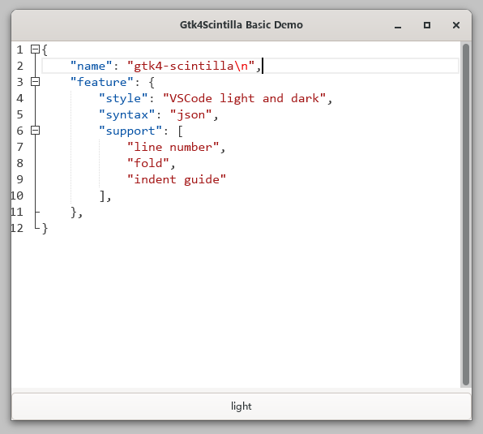

# Gtk4 Scintilla

**GTK4 Scintilla text widget.**

## Overview

It is still under development, but an demo is available now:




## Usage

```c
#include "gtkscintilla.h"

GtkApplication* app = NULL;
GtkWidget* sci;

void onActive()
{
	GtkWidget* win = gtk_application_window_new(app);
	gtk_window_set_title(GTK_WINDOW(win), "Gtk4Scintilla Basic Demo");

	sci = gtk_scintilla_new();
	gtk_widget_set_hexpand(sci, true);
	gtk_widget_set_vexpand(sci, true);

	gtk_scintilla_set_style(GTK_SCINTILLA(sci), "vscode");
	gtk_scintilla_set_language(GTK_SCINTILLA(sci), "json");
	gtk_scintilla_set_line_number(GTK_SCINTILLA(sci), true);
	gtk_scintilla_set_fold(GTK_SCINTILLA(sci), true);
	gtk_scintilla_set_indent_guides(GTK_SCINTILLA(sci), true);
	gtk_scintilla_set_wrap_mode(GTK_SCINTILLA(sci), GTK_WRAP_WORD);
	gtk_scintilla_set_tab_width(GTK_SCINTILLA(sci), 4);

	gtk_window_set_child(GTK_WINDOW(win), sci);
	gtk_window_set_default_size(GTK_WINDOW(win), 640, 480);
	gtk_window_present(GTK_WINDOW(win));
}

int main(int argc, char* argv[])
{
	gtk_init();
	app = gtk_application_new("com.github.xuges.gtk4scintilla.demo", 0);
	g_signal_connect(app, "activate", G_CALLBACK(onActive), NULL);
	g_application_run(G_APPLICATION(app), 0, NULL);
	return 0;
}
```

